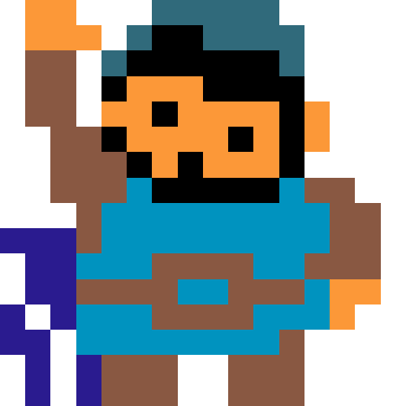

### The Legend Of Turgut - Le site

 

  

 

### Qui est Turgut?

Turgut est un personnage fictif d'anatolie, à l'époque où les peuples turcs vivaient encore comme des nomades. L'idée d'en faire un jeu d'aventure est simple la **Turquie** est un pays chargé d'histoire, le meilleur endroit pour un **RPG**. Le choix des graphismes en pixel, qui rappel le  **retro gaming.** est simple : ***me faciliter la tache et me focaliser sur le code***

### Pour en savoir plus visitez mon site : 

 <a href="https://kevinozkaraca.github.io/The-Legend-Of-Turgut-LeSite/" target="_blank">Cliquer ICI !</a>
   

### Mes reseaux sociaux : 

   
    

            
            
             
            
            
            
            
            
    
  

